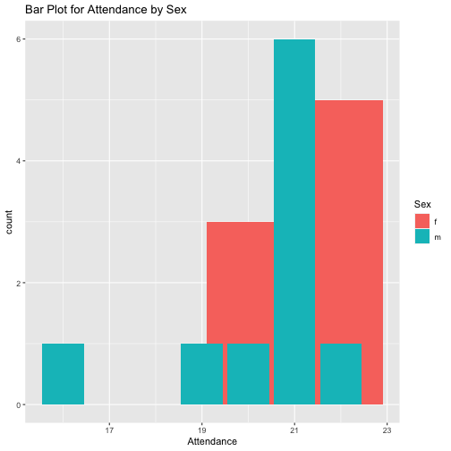

Archery Data Analysis
========================================================
author: Mauricio Marcos Fajgenbaun
date: February 2021
autosize: true
transition: rotate
font-family: "Helvetica"
css: custom.css


Details
========================================================
type: exclaim

</br></br>
In 2002, Heather Tollerud, a Saint Olaf College student, undertook a study of the **archery scores** of
students at the college who were enrolled in an archery course. Students taking the course record a
score for each day they attend class from the first until the last day. Hopefully the instruction they
receive helps them to improve their game.

Motivation
========================================================
type: exclaim
incremental: true

</br></br>

In this research, I intend to analyze the relationship between the *attandance* of the participants and the *improvement* they had.

For this, I will use a dataset containing information about 18 participants and their personal characteristics. 


Who here likes to practice archery?
========================================================
type: exclaim
incremental: true


```markdown
source:"https://stepoutside.org/article/10-best-archery-outfitters-in-michigan/"
```

Variable Description
========================================================
type: exclaim

This dataset contains 7 variables, 5 of them being continuous, and two other categorical.

<li class= "fragment fade-in"> Attendance: Number of days in class </li>
<li class= "fragment fade-in"> Average score over all days </li>
<li class= "fragment fade-in"> Sex: Coded as f or m </li>
<li class= "fragment fade-in"> Day1: Archery score on first day </li>
<li class= "fragment fade-in"> LastDay: Archery score on last day </li>
<li class= "fragment fade-in"> Improvement: Last day - first day score </li>
<li class= "fragment fade-in"> Improve: 1=improved or 0=did not improve </li>
  


Attandance Behaviour
========================================================
type: exclaim
incremental: true
  
Let´s take a look at the attandance of the participants according to their sex:
  



***
</br></br></br></br>
We can say, that it looks like women have attended (in proportion) more time the classes than man.
</br></br>
Also, there seem to be a minority of man who have not attended a lot of instruction classes.

Scatterplot of Attendance vs Average Score
========================================================
type: exclaim
id: slide1


 
<style>
  .p_iframe iframe {
    width:90%;
    height:576px;
}
</style>

<div class="p_iframe">
<iframe frameborder="0" seamless='seamless' scrolling=no src="plotly.html"></iframe>
</div>


Any questions?
====================================
type: exclaim

</br>
The plot that was showed before is of crucial importance to the understanding of the effect that attandance had in the average score of the participants. So if something was unclear, we can review it:

</br> </br> </br>
[Go back to plot](#/slide1)
